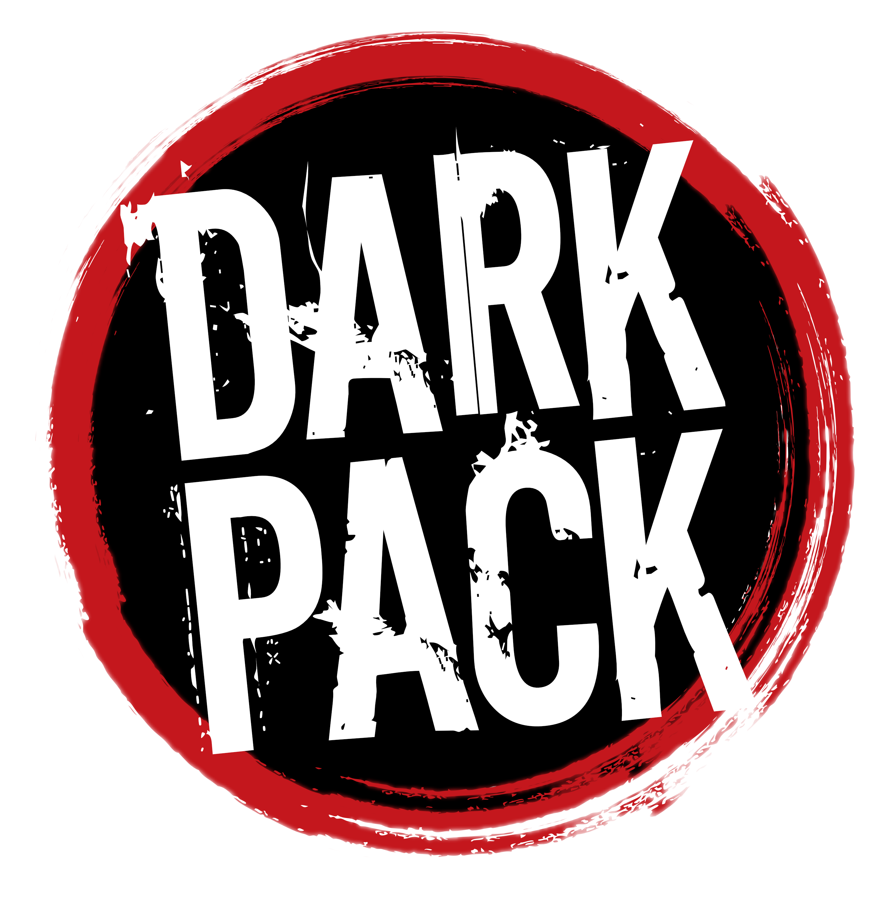

# WOD-Icons-Pack

An Extensive Icons Pack of World of Darkness Icons &amp; Emojis.

- Icons are available in .png and .svg formats.
- Directories are organized as follow: `./Splat/version/format/[color]`
  - `Splat` $\rightarrow$ `Vampire-The-Masquerade`, `Vampire-The-Requiem`, `Werewolf-The-Apocalypse`, etc
  - `format` $\rightarrow$ `png`, `svg`, etc.
  - `version` $\rightarrow$ `v5`, `v20`, `met` (Mind's Eye Theater), `fanmade` (Unofficial Fanmade Content), etc
  - `[color]` (Optional) $\rightarrow$ `red`, `green`, etc.
    - Default colors located in current directory.
- Any folder ending with `-fanmade` refers to open source fanmade content under **Dark Pack**. Credits to fanmade content are provided.

**Disclaimer**
- If your fanwork is listed here and you do not wish it to be listed, please contact me immediately.

## Credits
- [`dhampir.png`](Vampire-The-Masquerade/fanmade/png/dhampir.png) &amp; [(Red) `dhampir.png`](Vampire-The-Masquerade/fanmade/png/red/dhampir.png) made by [u/vstheworld65](https://www.reddit.com/user/vstheworld65/) on [Reddit](https://www.reddit.com/r/WhiteWolfRPG/comments/li1x38/fanmade_dhampir_ankh/).

## Notes

Below is a series of recommendations and notes.

- If you are hosting a World of Darkness Westmarches Discord server and are looking for emojis to stock your server with, it is highly recommend you utilize anything under the `[color]` directory. Due to the fact that Discord users commonly use Dark Mode. Ergo its simply hard to see. 

## TODO

- Try and fix `assamite_antitribu.svg`
- Upload Koschei symbol to `fanmade`
- Upload fanmade v5 Nictuku symbol to `fanmade`

## [License](License)

> Portions of the materials are the copyrights and trademarks of Paradox Interactive AB, and are used with permission. All rights reserved. For more information please visit [worldofdarkness.com](https://www.paradoxinteractive.com/games/world-of-darkness/about).